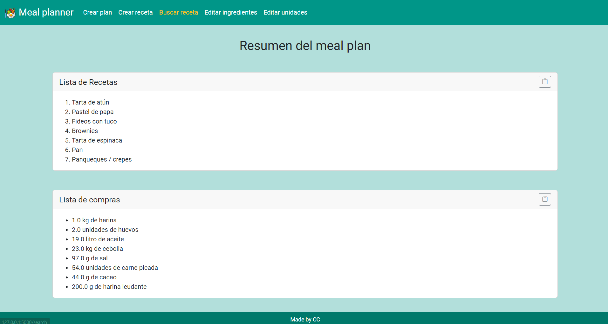

# Meal Planner

## Video Demo

https://youtu.be/S-jbNdHIXHc

## Description
Using Flask, this web-based application serves as a recipes-managing tool and a meal planner. It will create a random recipe list based on an amount of meals wanted by the user, allowing, afterwards, to obtain the shopping list associated with said list. It allows the user to add new recipes, edit existing ones and search through them.

<figure>
    
    <figcaption>A meal plan for 7 meals.</figcaption>
</figure>

<figure>
    
    <figcaption>The recipes list and shopping list available to copy to clipboard to export to a notes app.</figcaption>
</figure>

<figure>
    
    <figcaption>The menu used to create a new recipe, along with the new ingredients and units forms.</figcaption>
</figure>

<figure>
    
    <figcaption>The landing page of the app, displaying all of the recipes in the database.</figcaption>
</figure>


## Prerequisites
Before you begin, ensure you have met the following requirements:

- You have installed the latest version of Python.
- You have a working Windows, Mac or Linux computer.
- You have basic knowledge of use of the Unix terminal or Powershell interface.

## Installation 
1. Clone the repository
```bash
git clone https://github.com/CarolinaCampi/meal_planner.git
cd meal_planner
```
2. Create and activate a virtual environment
- For Unix/macOS:
```bash
python3 -m venv venv
source venv/bin/activate
```
- For Windows:
```bash
python -m venv venv
venv\Scripts\activate
```
3. Install the required dependencies
```bash
pip install -r requirements.txt
```

## Execution
To run the app, execute the following command of the app folder:
```bash
flask run
```

## Usage
To view and use the app, go to `http://127.0.0.1:5000` on your browser of choice.

## Flask Application Structure
The file tree of the app is composed as follows:
```
.
+─── app.py
+─── create_tables.py
+─── meal_planner.db
+─── populate_units_ingredients.py
+─── README.md
+─── requirements.txt
|           
+─── static
|    |─── favicon.ico
|    |─── styles.css
|       
\─── templates
     |─── create_plan.html
     |─── create_recipe.html
     |─── delete_ingredient.html
     |─── delete_recipe.html
     |─── delete_unit.html
     |─── edit_ingredients.html
     |─── edit_recipe.html
     |─── edit_single_ingredient.html
     |─── edit_single_unit.html
     |─── edit_units.html
     |─── index.html
     |─── layout.html
     |─── recipe.html
     |─── result.html
     |─── search.html
     |─── shopping_list.html
```
app.py: main file that contains all the logic and DB queries

templates folder: conatins .html files for the frontend. Specifically, in the layout.jtml file, the main layout, including navbar and footer are defined.

The app contains two Python files that used to create and populate some of the tables (ingredients, units, and recipes) in the database initially (create_tables.py and populate_units_ingredients.py).

The requirements.txt file is standard for a Flask app containing the details of the dependencies for the app.

## Used languages and technologies
- Flask: main framework for the web-based app
- AJAX: avoid having to reload pages and loose progress when sending requests to the backend
- Bootstrap: styles and responsiveness
- SQLite3: database handling

These technologies are used parallel to:
- Frontend languages: HTML, CSS, JavaScript, Jinja
- Backend languages: Python, JavaScript

## Current features
- Create a meal plan: the user can input the amount of meals they want to plan and the app suggests a random lists of meals from its database. The list is displayed and the user can choose to view the recipes list and the associated shopping list. On this second screen, both lists are available to copy to clipboard, making it easier for the user to paste it into their favourite notes/lists app of choice. The shopping list function adds up the total for each ingredient, helping the user tallying the quantities they need to purchase for their meal plan.
- Create a new recipe: the user can create new recipes to expand their pool of options. This function is also useful when the app is used as a recipe book, for safekeeping and managing recipes.
- Edit an exiting recipe: the user can edit an exiting recipe if, for example, upon cooking the recipe, a change is found to be needed in the instructions.
- Search within existing recipes: the app also works as a recipe manager where the user can keep their recipes, browse among them, display and edit them.
- Create new ingredients and units: new ingredients and units can be injected to the app from the create recipe and edit recipe menus. This was programed so that the progress in the creation/edit is not lost and the dropdown menus are updated but the posting to the database of the new ingredient/unit is still sent from the frontend using AJAX. 
- Edit ingredients and units: both ingredients and units can be edited and deleted. If its used in a recipe, the app does not allow the user to delete the ingredient/unit, to avoid losing exiting records.

## Contributing
1. Fork it (https://github.com/CarolinaCampi/meal_planner/fork)
2. Create your feature branch (`git checkout -b feature/fooBar`)
3. Commit your changes (`git commit -am 'Add some fooBar'`)
4. Push to the branch (`git push origin feature/fooBar`)
5. Create a new Pull Request

## Author’s info
Carolina Lucia Campi

carolinalcampi@gmail.com

https://github.com/CarolinaCampi

## License
Distributed under the GNU GPL v3.0 license. See LICENSE for more information.