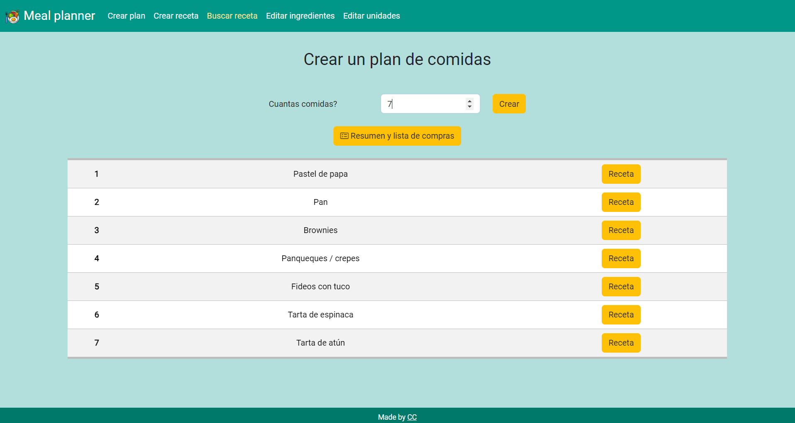
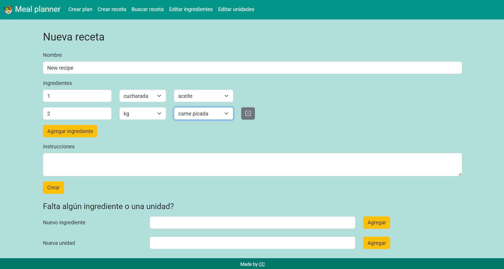
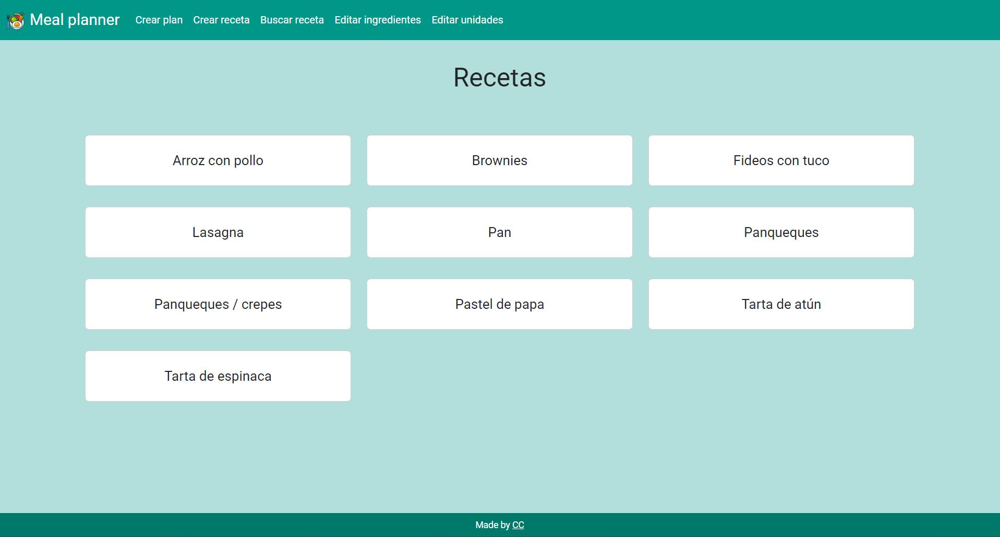

# Meal Planner

## Video Demo

## Description
Using Flask, this web-based application serves as a recipes-managing tool and a meal planner. It will create a random recipe list based on an amount of meals wanted by the user, allowing, afterwards, to obtain the shopping list associated with said list. It allows the user to add new recipes, edit existing ones and search through them.








## Prerequisites
Before you begin, ensure you have met the following requirements:

- You have installed the latest version of Python.

## Installation 
1. Clone the repository
```bash
git clone https://github.com/CarolinaCampi/meal_planner.git
cd meal_planner
```
2. Create and activate a virtual environment
    -   For Unix/macOS:
    ```bash
    python3 -m venv venv
    source venv/bin/activate
    ```
    - For Windows:
    ```bash
    python -m venv venv
    venv\Scripts\activate
    ```
3. Install the required dependencies
```bash
pip install -r requirements.txt
```

## Execution
```bash
flask run
```

## Usage
Go to `http://127.0.0.1:5000`

## Flask Application Structure
```
.
+─── app.py
+─── create_tables.py
+─── meal_planner.db
+─── populate_units_ingredients.py
+─── README.md
+─── requirements.txt
|           
+─── static
|    |─── favicon.ico
|    |─── styles.css
|       
\─── templates
     |─── create_plan.html
     |─── create_recipe.html
     |─── delete_ingredient.html
     |─── delete_recipe.html
     |─── delete_unit.html
     |─── edit_ingredients.html
     |─── edit_recipe.html
     |─── edit_single_ingredient.html
     |─── edit_single_unit.html
     |─── edit_units.html
     |─── index.html
     |─── layout.html
     |─── recipe.html
     |─── result.html
     |─── search.html
     |─── shopping_list.html
```

## Used languages and technologies
- Flask
- Bootstrap
- SQLite3
- Frontend languages: HTML, CSS, JavaScript, Jinja
- Backend languages: Python, JavaScript

## Current features
- Create meal plan: the user can input the amount of meals they want to plan and the app suggests a random lists of meals from its database. The list is diplayed and the user can choose to view the recipe list and the associated shopping list. On this screen, both lists are available to copy to clipboard, making it easier for the user to paste it into their notes/lists app of choice. The shopping list function adds up the total for each ingredient, helping the user tallying the quantities they need to purchase.
- Create new recipe: the user can create new recipes to expand their pool of options. This function is also useful when the app is used as a recipe book, for safekeeping recipes.
- Edit exiting recipe: the user can edit an exiting recipe if, for example, upon cooking the recipe, a change is found to be needed in the instructions.
- Search within existing recipes: the app also works as a recipe manager where the user can keep their recipes, browse among them, display and edit them.
- Create new ingredients and units: new ingredients and units can be injected to the app from the create recipe and edit recipe menus. This was programed so that the progess in the creation/edit is not lost and the dorpdown menus are updated but the posting to the database of the new ingredient/unit is still sent (using AJAX). 
- Edit ingredients and units: both ingredients and units can be edited and deleted. If its being used in a recipe, the app does not allow the user to delete the ingredient/unit

## Contributing
1. Fork it (https://github.com/CarolinaCampi/meal_planner/fork)
2. Create your feature branch (`git checkout -b feature/fooBar`)
3. Commit your changes (`git commit -am 'Add some fooBar'`)
4. Push to the branch (`git push origin feature/fooBar`)
5. Create a new Pull Request

## Author’s info
Carolina Lucia Campi - carolinalcampi@gmail.com

https://github.com/CarolinaCampi

## License
Distributed under the GNU GPL v3.0 license. See LICENSE for more information.